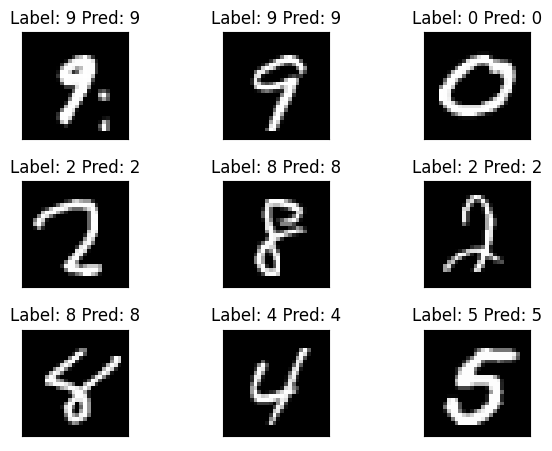

# forward-forward-algorithm

PyTorch implementation of [Forward-Forward Algorithm](https://www.cs.toronto.edu/~hinton/FFA13.pdf) introduced by Geoffrey Hinton in 2022.

* [Supervised forward-forward algorithm on MNIST](./supervised_ffa_mnist.ipynb)

## Additional Resources
* My implementation is improved version of [Mohammad Pezeshki's implementation](https://github.com/mohammadpz/pytorch_forward_forward)
* (Martin Görner's high level explanation)[[https://twitter.com/martin_gorner/status/1599755684941557761]] can be a good starting point